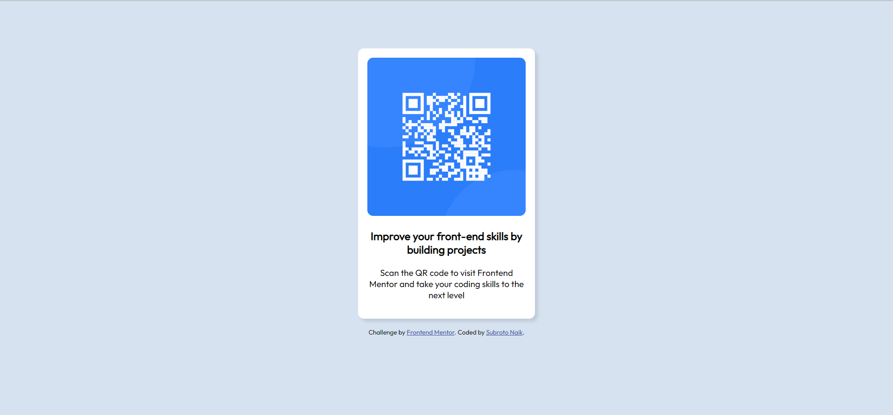
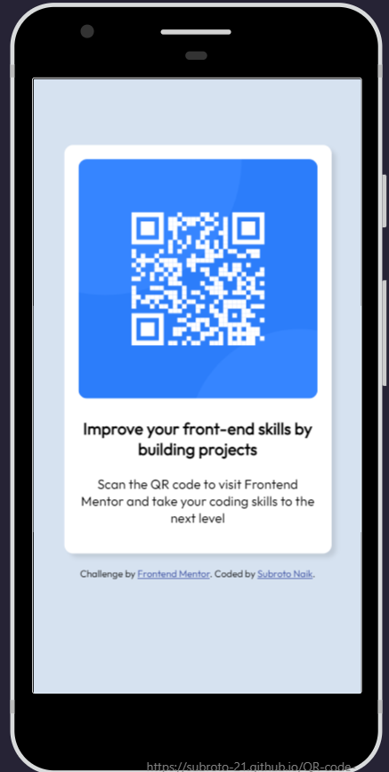

# Frontend Mentor - QR code component solution

This is a solution to the [QR code component challenge on Frontend Mentor](https://www.frontendmentor.io/challenges/qr-code-component-iux_sIO_H). Frontend Mentor challenges help you improve your coding skills by building realistic projects. 

## Table of contents

- [Overview](#overview)
  - [Screenshot](#screenshot)
  - [Links](#links)
- [My process](#my-process)
  - [Built with](#built-with)
  - [What I learned](#what-i-learned)
  - [Useful resources](#useful-resources)
- [Author](#author)

## Overview

### Screenshot




### Links

- Solution URL: https://github.com/Subroto-21/QR-code-component
- Live Site URL: https://subroto-21.github.io/QR-code-component/

## My process

### Built with

- Semantic HTML5 markup
- CSS custom properties
- Flexbox

### What I learned

Learned how to use Flexbox to align content at the center
```
body{
    display: flex;
    flex-direction: column;
    justify-content: center;
    align-items: center;
    height: 90vh;
    background-color: hsl(212, 45%, 89%);
    font-family: 'Outfit';
}
```

### Useful resources

- [w3schools-Flexbox](https://www.w3schools.com/css/css3_flexbox.asp) - Learned how to use flexbox from here

## Author
- Frontend Mentor - [@Subroto-21](https://www.frontendmentor.io/profile/Subroto-21)


